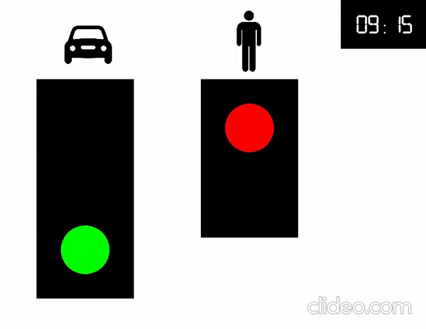
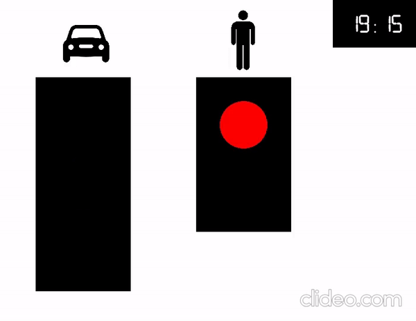

# Sistema de semáforos
Concepto de un sistema de semáforo implementado en C++, el cual cuenta con un semáforo con tres luces para los autos y un semáforo de dos luces para los peatones.

## Instalacion
Para poder ejecutar la interfáz gráfica, es necesario instalar la librería de SFML de acuerdo a la plataforma en la que se desee ejecutar.

### Windows
Se debe descargar la librería desde la página oficial de [`SFML`](https://www.sfml-dev.org/download/sfml/2.5.1/) y luego instalarla.
Asegurarse de tener un compilador de C++ instalado en el sistema, por ejemplo [`MinGW`](https://sourceforge.net/projects/mingw/).

### Linux
Se debe instalar la librería de SFML usando el siguiente comando.

```
sudo apt-get install libsfml-dev
```

## Compilación y ejecución
### Windows
Es necesario tener instalado [`CLion`](https://www.jetbrains.com/es-es/clion/) y desde allí, abrir la carpeta source.
CLion detectará el archivo `CMakeLists.txt` y estará listo para ejecutarse.

### Linux
Se puede realizar de la misma manera que en Windows si se tiene CLion instalado.
De no ser así, también puede ser compilado y ejecutado por consola, siguiendo los comandos siguientes.

```
~/Sistema_de_Semaforo$  cd source
~/Sistema_de_Semaforo/source$  cmake CMakeLists.txt
~/Sistema_de_Semaforo/source$  make
~/Sistema_de_Semaforo/source$  ./Sistema_Semaforo
```

De esta manera, se va a abrir la ventana gráfica y se va a poder hacer uso del software.

## Funcionalidad
Cuando se abre la ventana gráfica al momento de ejecutar el programa, aparecerán 2 semáforos, el de la izquierda correspondiente a los autos y el de la derecha a los peatones.

También, en la parte superior derecha, se encuentra un reloj que va a estar inicializado a las 06.00 y va a comenzar a correr a una velocidad de 30 min/seg, más que todo para poder ver las demás funcionalidades.

Al principio, el semáforo de los autos se va a encontrar con la luz verde encendida, y el de los peatones con la luz roja encendida. Pero si se presiona la tecla `Enter`, se van a ejecutar los siguientes procedimientos.

* Espera 2 segundos.
* Muestra la luz amarilla para los carros por 2 segundos.
* Cierra para los carros y simultáneamente abre para los peatones.
* Mantiene este estado por 5 segundos.
* Se activa Luz roja intermitente para los peatones durante 3 segundos.
* El semáforo cierra para los peatones y, simultáneamente, abre para los carros (estado inicial).

Los procedimientos se pueden ver en la siguiente animación.



Los procedimientos anteriormente mencionados solamente se pueden ejecutar en los rangos de horas de 06:00 a 18:00.

Fuera de estas horas, ambos semáforos van a entrar en un estado de hibernación. En este estado, el semáforo de los carros va a parpadear la luz amarilla, y el semáforo de los peatones va a parpadear la luz roja.

Este estado de hibernación se muestra en la siguiente animación.


